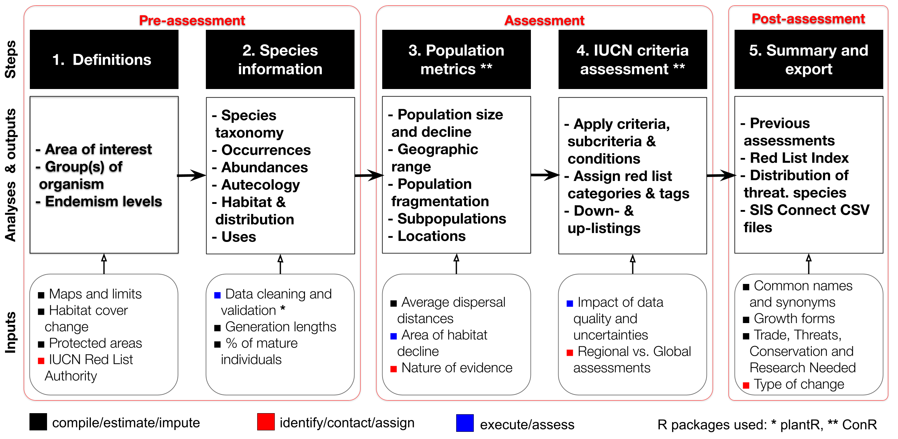

<!-- README.md is generated from README.Rmd. Please edit that file -->

# The threat status of endemic Atlantic Forest trees (THREAT)

### Introduction

This repository stores the data, scripts and functions of the project
‘The threat status of endemic Atlantic Forest trees’ (THREAT), aims at
supporting the conservation of the Atlantic Forest tree species. Among
other ways, this support is provided by the development of a workflow
(and the related codes and software) for synthesizing the information
necessary for obtaining comprehensive species conservation assessments
based on multiple IUCN criteria (A, B, C and D). The main result of this
workflow is IUCN Red List assessments per se.

The THREAT workflow was developed in close association with the IUCN Red
List Authority for Brazilian Plants (CNCFlora -
<http://cncflora.jbrj.gov.br>) and has been validated by the Global Tree
Assessment staff (www.bgci.org/our-work/networks/gta), to ensure an
workflow that follows the IUCN Red List Categories and Criteria and thus
conservation assessments that can be more easily incorporated into the
IUCN Red List of Threatened Species (www.iucnredlist.org).

The workflow includes the evaluation of possible biases and
uncertainties related to the quality of the data and the inference of
species information necessary to perform the conservation assessments
following the IUCN guidelines. Moreover, the workflow produces the files
required to enter the assessments in the IUCN Species Information
Service (SIS) system (SIS Connect - <https://connect.iucnredlist.org>),
a more technical but crucial step of the incorporation of the
assessments into the IUCN Red List.

The codes presented here were produced specifically for the Atlantic
Forest tree species. It needs to be adapted prior to its use for other
groups of organisms or different regions worldwide.

### Description of the workflow

The THREAT workflow for obtaining species conservation assessments using
multiple IUCN criteria contains five main steps (Figure 1).

 **Figure 1**. The THREAT
workflow.

  The main steps of the workflow are:

1.  **Definitions**: the basic definitions that will determine which
    species will be included in the assessments.  
2.  **Species information**: the most important information that must be
    compiled, estimated or imputed to obtain the population metrics.
3.  **Population metrics**: the population metrics defined by the IUCN
    as indicators of the threat of a species or taxon.
4.  **IUCN criteria assessment**: The conservation assessment itself.
5.  **Summary and export**: summary of the overall results of the
    assessment and the export of the information necessary for
    submission to the IUCN.

Note that the first two steps mostly involves the compilation of the
necessary information from the study region and the group of organism
included in the assessment. Although they are the first steps of the
workflow, this repository assumes that the this information was already
compiled and it is available within the `data` folder.

 

##### Details on step 1

Step 1 will define which assessments will be global (for all population
of the species) or regional (for populations of the species). For
instance, THREAT assessments are regional (i.e. Atlantic Forest), so for
species that are non-endemic and endemic to the Atlantic Forest the
assessments are regional and global, respectively. This is why it is
important to know beforehand the endemism level (e.g. endemic,
non-endemic, vagrant) of all species occurring in respect to the target
region (see Lima et al. 2020 for the example for the Atlantic Forest
trees). In addition, depending on the group of organism, long
time-series of habitat cover will be necessary obtain the population
size reductions based on habitat loss. This is often the case for tree
species.

Indentifying and contacting local IUCN Red List Authorities as early as
possible is a key step to make sure that methods are aligned with IUCN
guideliness and their own redlisting workflows. They are the
responsibles for submitting the assessments in the IUCN Red List and
they can facilitate the process of reviewing the assessments before
submission.

 

##### Details on step 2

In Step 2, species occurrence records are the input data used to obtain
the species geographic range and other spatial population metrics that
are required to assess the IUCN criterion B (see function
`ConR::criterion_B()`). On the other hand, the input data required to
assess the IUCN criterion A (i.e. population size decline) is a vector
of population sizes per year (see function `ConR::criterion_A()`). That
is, the workflow currently does not provide the codes to obtain
population sizes from abundances, which can be done using very different
approaches depending on the group of study and the nature of evidence
(i.e. observed, estimated, inferred or suspected). What the workflow do
provide is a tool to estimate species-specific population size reduction
at an specific point in time, which is needed for the assessments using
criterion A and C (see section ‘Details on step 3’).

Species occurrence data should be submitted to a data cleaning and
validation process to make sure that only the data with a minimum
quality will be used in the assessments. The `plantR` package (Lima et
al. 2022) provides different tools to standardise the notation
associated with species records and to validate the locality,
geographical coordinates, taxonomic nomenclature and species
identifications. It also include tools the retrieval and removal of
specimen duplicates across biological collections.

Different species information will probably be missing for some or many
species, depending on the available knownledge of the target. Some of
this information, however, is esssential to the assessment of one or
more IUCN criteria. They include the Generation Length (GL), the
Proportion of Mature Individuals (p) in the population and the Average
Dispersal Distance (DD) of the species. Thus, this information needs to
be estimated or imputed making use of the best data currently available.
In THREAT, GL and p were generalized for groups of species defined based
on their potential maximum height as an adult and on their ecological
groups. The choice of which values were assigned to each group was based
on the empirical evidence currently available in the literature. For
estimating DD, we implemented the function `ConR::subpop.radius()` that
applies the circular buffer method (Rivers et al., 2010) for obtaining
species-specific proxies of DD.

 

##### Details on step 3

Different population metrics are necessary for applying the the IUCN
criteria A, B, C and D. A new version 2.0 of the`ConR` package (Dauby et
al. 2017, Dauby & Lima 2022) was develop to calculate most of these
metrics.

For criterion A, the `ConR` package provides a function for fitting
statistical models to the population size vector to obtain the
reductions at an specific point in time (`ConR::pop.decline.fit()`),
based on linear, exponential, quadratic, logistic and other trends of
population decline through time. The time interval of population decline
needed for the assessments of criterion A or C (10 years or one, two,
three generation lengths - see IUCN 2019) often do not correspond
exactly to the observed population sizes for most species.

For criterion B, the `ConR` package provides functions for calculating
the Extent of Occurrence (EOO - `ConR::EOO.computing()`), Area of
Occupancy (AOO - `ConR::AOO.computing()`), Number of Subpopulations
(`ConR::subpop.comp()`) and Number of Locations
(`ConR:::locations.comp`). Although omitted from the THREAT workflow,
the detection of fluctuations in populations sizes is also an important
aspect of the IUCN for some groups of organisms. In addition, the
package provides a function `ConR::AOH.estimation()` to calculate the
amount and the change in available habitat within the species EOO. This
is still not used as a metric in the assessments but it can be used as a
measure of continuing decline, one of the conditions necessary for
assessing criterion B.

 

##### Details on step 4

This step correspond to the assignment of one of the IUCN Red List
Categories (i.e. EX, EW, CR, EN, VU, NT, LC, DD) by comparing the
population metrics obtained in the previous step against the IUCN
quantitative thresholds and conditions. It can also include possible
tags, such as the ‘Possibly Extinc tag for Critically Endangered
species’.

In the case of multiple IUCN criteria, there is also the need for having
a consensus category from the result of each of the criteria. In the
case of regional assessments, this step may also include down-listings
or up-listings which should be duly noted.

As mentioned above, specific functions were develop to assess the IUCN
criteria A, B, C and D and to generate consensus categories among these
criteria and they are available in the new version 2.0 of the`ConR`
package (Dauby et al. 2017, Dauby & Lima 2022). This new version also
provides functions to assess the sensitivity of species Extent of
Occurrence from the inclusion of different types of records (e.g. not
taxonomically validated records) - function `ConR::EOO.sensitivity()`.

 

##### Details on step 5

(To be finished)

### Organization and content

This repository is structured as follows:

- [`R/`](https://github.com/LimaRAF/THREAT/tree/master/R/): contains the
  R scripts to run each step of the workflow and some acessory functions
  developed especially for it.

- [`data/`](https://github.com/LimaRAF/THREAT/tree/master/data):
  contains raw, acessory or derived/edited data needed for running the
  codes, from

- [`figures/`](https://github.com/LimaRAF/THREAT/tree/master/figures):
  contains all the figures created during the workflow

- [`SIS_sample_6_1/`](https://github.com/LimaRAF/Data_harmonization/tree/master/SIS_sample_6_1):
  contains sample examples of the IUCN SIS connect files used as a
  standard to build the IUCN required SIS CONNECT CSV files

### Authors and contributors

Renato A. F. de Lima & Gilles Dauby

### How to cite

Please cite this repository as:

> **{{ Renato A. F. de Lima, Gilles Dauby, André L. de Gasper, Eduardo
> P. Fernandez, Alexander C. Vibrans, Alexandre A. de Oliveira, Paulo I.
> Prado, Vinícius C. Souza, Marinez F. de Siqueira & Hans ter Steege.
> (2023). The Atlantic Forest trees: a flora on the verge of extinction.
> Manuscript under review }}**

### Funding

The development of this repository wasfunded by the European Union’s
Horizon 2020 research and innovation program under the Marie
Skłodowska-Curie grant agreement No 795114. Forest inventory data was
funded by grants 2013/08722-5 (São Paulo Research Foundation - FAPESP),
312075/2013-8 (Brazilian National Council for Scientific and
Technological Development - CNPq), and 2017TR1922 (Santa Catarina
Research Foundation - FAPESC).

### Acknowledgements

We thank the CNCFlora staff (Patricia da Rosa, Gustavo Martinelli, Eline
Martins, Rafael Loyola, Pablo H.A. de Melo, Thaís L.B. da Cunha, Eduardo
P. Fernandez, Marinez F. de Siqueira) for the advice on how to apply the
IUCN Red List Categories and Criteria for the Atlantic Forest tree
species. We also thank Malin Rivers and Emily Beech (BGCI) for reviewing
the methodological approach stored in this repository.

### References

> G. Dauby, T. Stévart, V. Droissart, A. Cosiaux, V. Deblauwe, M.
> Simo-Droissart, M. S. M. Sosef, P. P. Lowry, G. E. Schatz, R. E.
> Gereau, T. L. P. Couvreur, ConR: An R package to assist large-scale
> multispecies preliminary conservation assessments using distribution
> data. Ecol. Evol. 7, 11292–11303 (2017).

> G. Dauby, R. A. F. de Lima, ConR: Computation of Parameters Used in
> Preliminary Assessment of Conservation Status (R package version
> 2.0.0) (2022).

> IUCN Standards and Petitions Committee, Guidelines for Using the IUCN
> Red List Categories and Criteria. Version 14. (Prepared by the
> Standards and Petitions Committee, 2019).

> R. A. F. Lima, V. C. Souza, M. F. de Siqueira, H. ter Steege, Defining
> endemism levels for biodiversity conservation: Tree species in the
> Atlantic Forest hotspot. Biol. Conserv. 252, 108825 (2020).

> R. A. F. de Lima, A. Sánchez‐Tapia, S. R. Mortara, H. ter Steege, M.
> F. de Siqueira, plantR: An R package and workflow for managing species
> records from biological collections. Methods Ecol. Evol. 14(2),
> 332-339 (2023).

> M. C. Rivers, S. P. Bachman, T. R. Meagher, E. Nic Lughadha, N. A.
> Brummitt, Subpopulations, locations and fragmentation: applying IUCN
> red list criteria to herbarium specimen data. Biodivers. Conserv. 19,
> 2071–2085 (2010).
